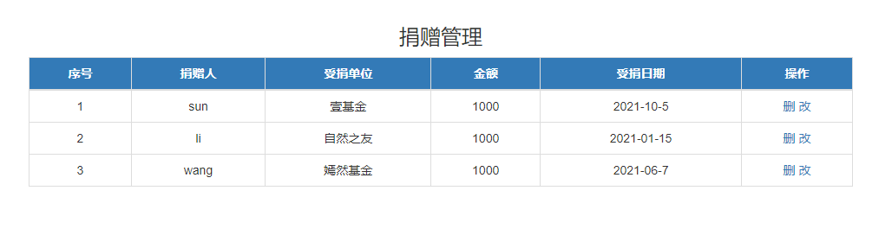
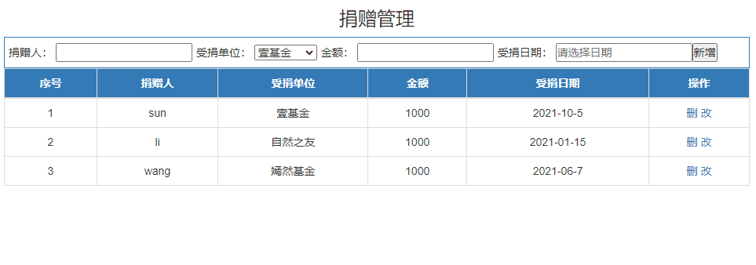
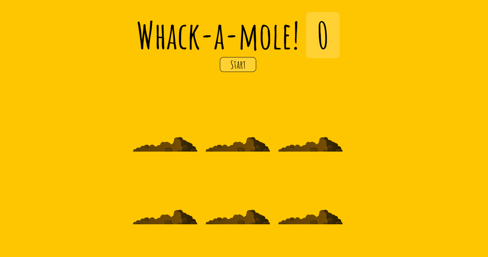
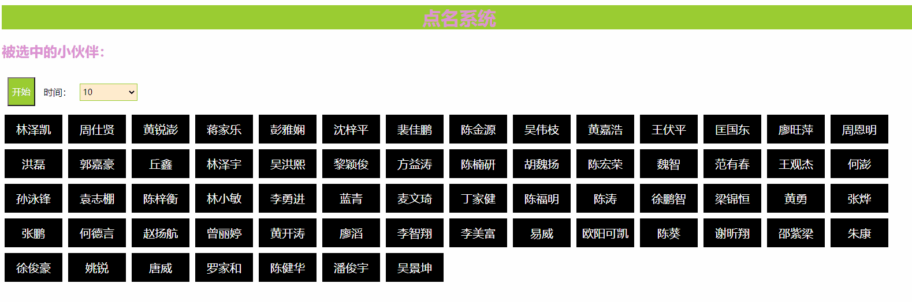
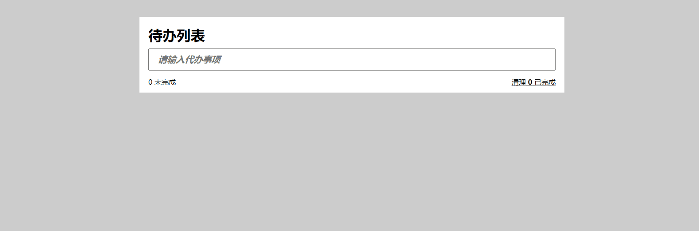

# webAPI 项目实战 两天

## 要求

一共6个题目

- (必完成) 已有数据的基本渲染  初级难度
- (必完成) 数据的基本添加和渲染 初级难度
- (必完成) 数据的基本操作及持久化 初级难度
- 打地鼠   中级难度
- 点名系统  中级难度
- 今日待办  高级难度 


## 捐赠管理-数据渲染



### 功能需求

**实现页面渲染即可，不用考虑其他功能**

### 数据结构

```js
[
    // id:数据编号  person:捐赠人姓名   unit:捐赠单位名称  money:捐赠金额  date:捐赠日期
    { id: 1, person: '刘德化', unit: '壹基金', money: 1000, date: '2021-10-5' },
    { id: 2, person: '周杰伦', unit: '自然之友', money: 1000, date: '2021-01-15' },
    { id: 3, person: '李连杰', unit: '嫣然基金', money: 1000, date: '2021-06-7' }
]
```


## 捐赠管理-添加和渲染



### 功能需求

1. 实现页面的数据渲染
2. 点击 **新增**  实现新增一个记录


## 捐赠管理-删除-本地存储

### 功能需求

在上一个案例的基础上实现：

1. 点击 **删改** 实现删除对应的数据
2. 实现页面**刷新**后，数据还**保留**刷新前模样 （本地存储）

## 打地鼠

> http://sites.zbztb.cn/clobber/index.html




### 功能需求

1. 点击 按钮 **START**  地鼠随机的在6个洞中缓慢出现
2. 点击地鼠时，分数在原有基础上加一


## 点名系统

> http://sites.zbztb.cn/callnames/index.html



### 功能需求

1. 点击按钮 **开始**  ，实现随机显示 同学名单

2. 一段时间后，将选中的同学名单 显示在 页面的大标题上

   

3. 继续点击时，在剩下的同学名单中继续 随机抽取


## 今日待办

> http://sites.zbztb.cn/todo/index.html




### 功能需求

1. 输入框中 按下 **回车键** 将数据生成到 列表种
2. 点击 列表中的**删除** 实现删除数据功能
3. 点击 列表中的 **复选框**  实现 该列表显示删除线  如 ~~事项三~~
4. 根据列表状态，计算出 底部的  **未完成**   和 **已完成**

